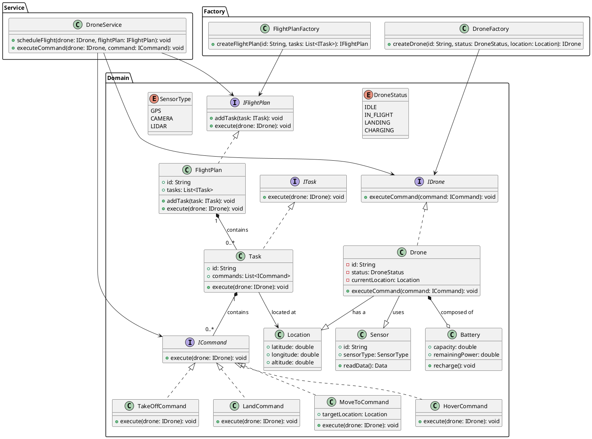

```puml
@startuml
top to bottom direction
package "Domain" {
    ' 无人机接口定义
    interface IDrone {
        + executeCommand(command: ICommand): void
    }
    ' 无人机聚合根定义
    class Drone implements IDrone {
        - id: String
        - status: DroneStatus
        - currentLocation: Location
        + executeCommand(command: ICommand): void
    }
    ' 无人机状态枚举
    enum DroneStatus {
        IDLE
        IN_FLIGHT
        LANDING
        CHARGING
    }
    ' 任务接口定义
    interface ITask {
        + execute(drone: IDrone): void
    }
    ' 任务实体定义
    class Task implements ITask {
        + id: String
        + commands: List<ICommand>
        + execute(drone: IDrone): void
    }
    ' 飞行计划接口定义
    interface IFlightPlan {
        + addTask(task: ITask): void
        + execute(drone: IDrone): void
    }
    ' 飞行计划聚合根定义
    class FlightPlan implements IFlightPlan {
        + id: String
        + tasks: List<ITask>
        + addTask(task: ITask): void
        + execute(drone: IDrone): void
    }
    ' 命令接口定义
    interface ICommand {
        + execute(drone: IDrone): void
    }
    ' 起飞命令实体定义
    class TakeOffCommand implements ICommand {
        + execute(drone: IDrone): void
    }
    ' 降落命令实体定义
    class LandCommand implements ICommand {
        + execute(drone: IDrone): void
    }
    ' 移动命令实体定义
    class MoveToCommand implements ICommand {
        + targetLocation: Location
        + execute(drone: IDrone): void
    }
    ' 悬停命令实体定义
    class HoverCommand implements ICommand {
        + execute(drone: IDrone): void
    }
    ' 位置信息值对象定义
    class Location {
        + latitude: double
        + longitude: double
        + altitude: double
    }
    ' 传感器实体定义
    class Sensor {
        + id: String
        + sensorType: SensorType
        + readData(): Data
    }
    ' 传感器类型枚举
    enum SensorType {
        GPS
        CAMERA
        LIDAR
    }
    ' 电池实体定义
    class Battery {
        + capacity: double
        + remainingPower: double
        + recharge(): void
    }
}
package "Service" {
    ' 无人机服务
    class DroneService {
        + scheduleFlight(drone: IDrone, flightPlan: IFlightPlan): void
        + executeCommand(drone: IDrone, command: ICommand): void
    }
}
package "Factory" {
    ' 无人机工厂
    class DroneFactory {
        + createDrone(id: String, status: DroneStatus, location: Location): IDrone
    }
    ' 飞行计划工厂
    class FlightPlanFactory {
        + createFlightPlan(id: String, tasks: List<ITask>): IFlightPlan
    }
}
' 类之间的关系定义
Drone --|> Location : has a
Drone *--o Battery : composed of
Drone --|> Sensor : uses
FlightPlan "1" *-- "0..*" Task : contains
Task "1" *-- "0..*" ICommand : contains
Task --> Location : located at
DroneService --> IDrone
DroneService --> IFlightPlan
DroneService --> ICommand
DroneFactory --> IDrone
FlightPlanFactory --> IFlightPlan
@enduml
```